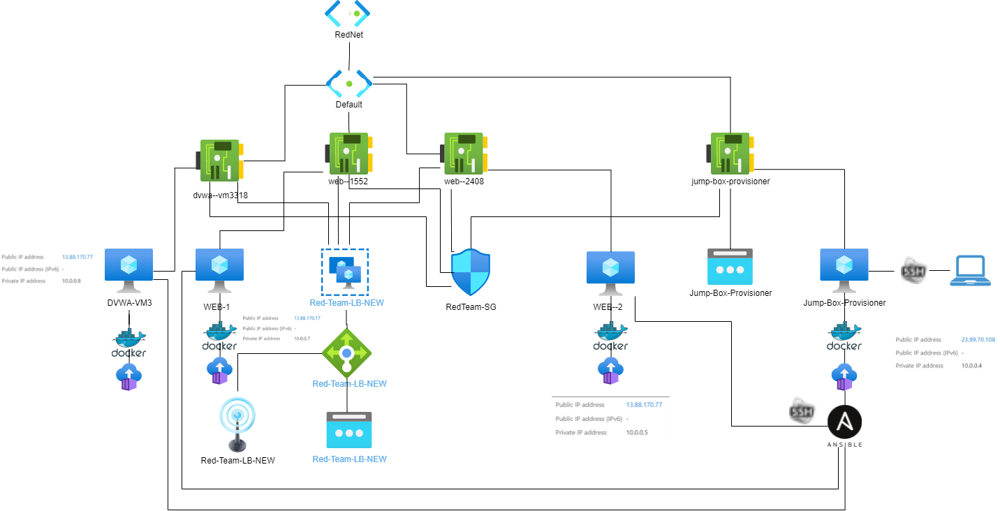

=======
# crispy-lamp
GitHub Repository for Cybersecurity Unit 13
## Automated ELK Stack Deployment

The files in this repository were used to configure the network depicted below.


=======

These files have been tested and used to generate a live ELK deployment on Azure. They can be used to either recreate the entire deployment pictured above. Alternatively, select portions of the playbook file may be used to install only certain pieces of it, such as Filebeat.

  - filebeat_playbook.yml
  ```
  ---
- name: installing and launching filebeat
  hosts: webservers
  become: yes
  tasks:

  - name: download filebeat deb
    command: curl -L -O https://artifacts.elastic.co/downloads/beats/filebeat/filebeat-7.4.0-amd64.deb

  - name: install filebeat deb
    command: dpkg -i filebeat-7.4.0-amd64.deb

  - name: drop in filebeat.yml
    copy:
      src: /etc/ansible/filebeat-config.yml
      dest: /etc/filebeat/filebeat.yml

  - name: enable and configure system module
    command: filebeat modules enable system

  - name: setup filebeat
    command: filebeat setup

  - name: Start filebeat service
    command: service filebeat start

  - name: enable service filebeat on boot
    systemd:
      name: filebeat
      enabled: yes
  
  ```
  - metricbeat_playbook.yml
 ```
 ---
- name: installing and launching metricbeat
  hosts: webservers
  become: yes
  tasks:

  - name: download metricbeat deb
    command: curl -L -O https://artifacts.elastic.co/downloads/beats/metricbeat/metricbeat-7.4.0-amd64.deb

  - name: install metricbeat deb
    command: dpkg -i metricbeat-7.4.0-amd64.deb

  - name: drop in metricbeat.yml
    copy:
      src: /etc/ansible/metricbeat-config.yml
      dest: /etc/metricbeat/metricbeat.yml

  - name: enable and configure system module
    command: metricbeat modules enable system

  - name: setup metricbeat
    command: metricbeat setup

  - name: Start metricbeat service
    command: service metricbeat start

  - name: enable service metricbeat on boot
    systemd:
      name: metricbeat
      enabled: yes
 ```
  - install_elk.yml
  
  ```
  ---
- name: Configure Elk VM with Docker
  hosts: elk
  remote_user: azdmin
  become: true
  tasks:

    # Use apt module
    - name: Install docker.io
      apt:
        update_cache: yes
        force_apt_get: yes
        name: docker.io
        state: present

# Use apt module
    - name: Install python3-pip
      apt:
        force_apt_get: yes
        name: python3-pip
        state: present

    # Use pip module
    - name: Install Docker module
      pip:
        name: docker
        state: present

    # Use command module
    - name: Increase virtual memory
      command: sysctl -w vm.max_map_count=262144

# Use sysctl module
    - name: Use more memory
      sysctl:
        name: vm.max_map_count
        value: 262144
        state: present
        reload: yes

    # Use docker_container module
    - name: download and launch a docker elk container
      docker_container:
        name: elk
        image: sebp/elk:761
        state: started
        restart_policy: always
        # Please list the ports that ELK runs on
        published_ports:
          -  5601:5601
          -  9200:9200
          -  5044:5044
  ```
  
 
This document contains the following details:
- Description of the Topology
- Access Policies
- ELK Configuration
  - Beats in Use
  - Machines Being Monitored
- How to Use the Ansible Build


### Description of the Topology

The main purpose of this network is to expose a load-balanced and monitored instance of DVWA, the D*mn Vulnerable Web Application.

Load balancing ensures that the application will be highly available, in addition to restricting access to the network.
Load balancers destribute traffic evenly throughout the network to prevent overloading a particular resourse. This helps improve availabilty and performance of websites and applications and also prevents against DDoS attacks.
A jump box is a gateway into a remote network. It is used to access and manage devices first in a secure zone before connecting to other servers and devices

Integrating an ELK server allows users to easily monitor the vulnerable VMs for changes to the log files and system resources.
- Filebeat watches for log files and collects log events. Then forwards them to Elasticsearch for Logstash for indexing.
- Metricbeat records metrics and statistics and forwards them to Elasticsearch or Logstash.

The configuration details of each machine may be found below.

| Name     | Function | IP Address | Operating System |
|----------|----------|------------|------------------|
| Jump Box | Gateway  | 10.0.0.1   | Linux            |
| Web--1   | Webserver| 10.0.0.7   | Linux            |
| Web--2   | Webserver| 10.0.0.5   | Linux            |
| DVWA--VM3| Webserver| 10.0.0.8   | Linux            | 
| ELK-VM   | Elk stack| 10.1.0.4   | Linux            |

### Access Policies

The machines on the internal network are not exposed to the public Internet. 

Only the Jump Box machine can accept connections from the Internet. Access to this machine is only allowed from the following IP addresses:
- 71.205.228.90

Machines within the network can only be accessed by the Jump Box machine using SSH.
- Jump Box Public IP address
23.99.70.108
- Jump Box Private IP address
10.0.0.4

A summary of the access policies in place can be found in the table below.

| Name      | Publicly Accessible | Allowed IP Addresses |
|-----------|---------------------|----------------------|
| Jump Box  | Yes                 | 71.205.228.90        |
| Web--1    | No                  | 71.205.228.90        |
| Web--2    | No                  | 71.205.228.90        |
| DVWA--VM3 | No                  | 71.205.228.90        |
| ELK-VM    | No                  | 71.205.228.90        |

### Elk Configuration

Ansible was used to automate configuration of the ELK machine. No configuration was performed manually, which is advantageous because...
- Ansible is able to perform consistently and automatically across multiple machines.

The playbook implements the following tasks:
- Install Docker
- Install Python
- Install Docker python module
- Use more memory
- Download and launch a docker elk container

The following screenshot displays the result of running `docker ps` after successfully configuring the ELK instance.


### Target Machines & Beats
This ELK server is configured to monitor the following machines:
- WEB--1  10.0.0.7
- WEB--2  10.0.0.5

We have installed the following Beats on these machines:
- Metricbeat
- Filebeat

These Beats allow us to collect the following information from each machine:
- Metricbeat is a lightweight shipper that can be installed on your servers to collect metrics from the operating system and from services running on the server. Apache is one example of these services and is widely used to accept HTTP requests from internet users and sends them information in the form of files and Web pages.
- Filebeat is a lightweight shipper for forwarding and centralizing log data. Filebeat monitors the speicified log files or locations, collects log events, and forwards them to Elasticsearch or Logstash for indexing. Filebeat can monitor failed SSH attempts. 

### Using the Playbook
In order to use the playbook, you will need to have an Ansible control node already configured. Assuming you have such a control node provisioned: 

SSH into the control node and follow the steps below:
- Copy the provided configuraton file for Filebeat to your Ansible container.
- Update the configuration file to include your ELK server's IP address.
- Scroll to line #1106 and replace the IP address with the IP address of your ELK machine.
- Scroll to line #1806 and replace the IP address with the IP address of your ELK machine.
- Save this file in  /etc/ansible/files/filebeat-config.yml.
- Run the playbook, and navigate to ELK-IP-ADDRESS:5601/app/kibana to check that the installation worked as expected.


- _Which file is the playbook? Where do you copy it?_
- The filebeat_playbook.yml, metricbeat_playbook.yml, and install-elk.yml are all playbooks. They are copied to the /etc/ansible directory. 
- _Which file do you update to make Ansible run the playbook on a specific machine? How do I specify which machine to install the ELK server on versus which to install Filebeat on?_
- Update the Ansible hosts file /etc/ansible/hosts with the appropriate IP address for each machine. 
   - For example, to include machine WEB--1 you would add: 10.0.0.7 ansible_python_interpreter=/usr/bin/python3 
- _Which URL do you navigate to in order to check that the ELK server is running?
- ELK-IP-ADDRESS:5601


_As a **Bonus**, provide the specific commands the user will need to run to download the playbook, update the files, etc._
Create the Filebeat Configuration File
Open a terminal and SSH into your jump box:
- ssh azdmin@23.99.70.108
Start the Ansible container.
- sudo docker container list -a
- sudo docker start adoring_noether
SSH into the Ansible container.
- sudo docker attach adoring_noether
- cd /etc/ansible
Copy the configuration file for Filebeat to your Ansible container: 
- Run: curl https://gist.githubusercontent.com/slape/5cc350109583af6cbe577bbcc0710c93/raw/eca603b72586fbe148c11f9c87bf96a63cb25760/Filebeat > /etc/ansible/files/filebeat-config.yml
Edit the file to include your ELK server's IP address.
Scroll to line #1106 and replace the IP address with the IP address of your ELK machine.
- hosts: ["10.1.0.4:9200"]
Scroll to line #1806 and replace the IP address with the IP address of your ELK machine.
- host: "10.1.0.4:5601"
Save this file in  /etc/ansible/files/filebeat-config.yml.

Create the Filebeat Installation Play
- Create filebeat_playbook.yml (as shown above)
- After updating the Filebeat configuration file and playbook, run: ansible-playbook filebeat-playbook.yml.

Verify Installation and Playbook
Navigate to Kibana
- ELK-IP-ADDRESS:5601/app/kibana
- Click System Logs
- Click Check Data.
- Scroll to the bottom and click on Verify Incoming Data.
